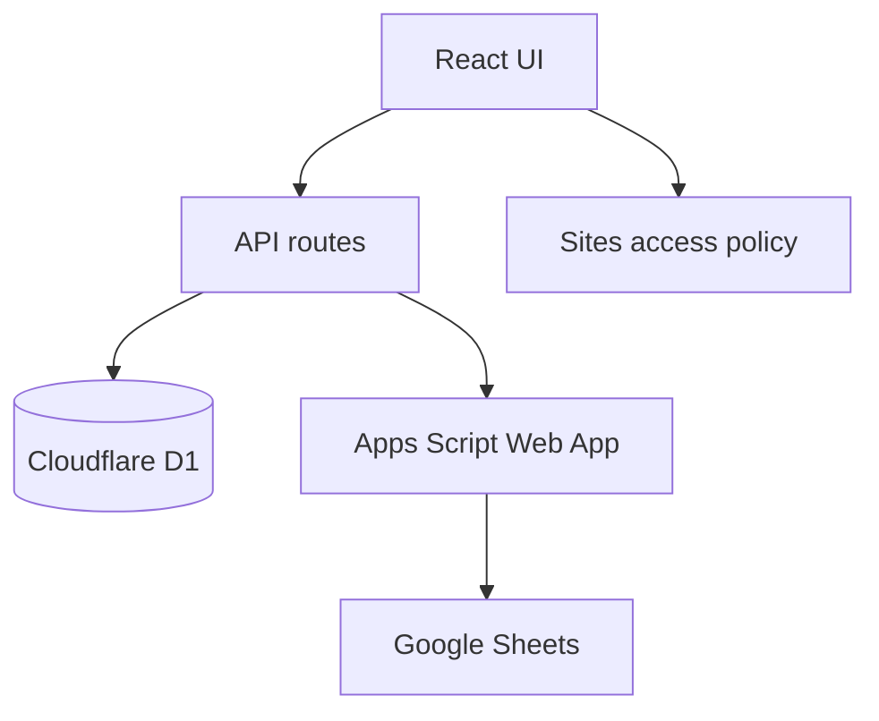

# Kiến trúc ứng dụng

## Tổng quan

Ứng dụng được build bằng Vinext/Vite và chạy trong Cloudflare Worker. API route và UI cùng nằm trong một codebase.

## Request flow

### Task

1. UI gọi `/api/tasks`.
2. API lấy D1 qua `getDb()`.
3. `getDb()` kiểm tra runtime schema để các deployment cũ không lỗi vì thiếu bảng/cột.
4. Khi task nguồn Sheet đổi trạng thái, API thử ghi về Apps Script bridge.
5. Kết quả trả về gồm task và trạng thái writeback.

### Sheet Sync

1. UI gọi `/api/integrations/sheets`.
2. Không có bridge: import snapshot trong `app/data/duoc-si-giang-plan.json`.
3. Có bridge: API đọc JSON từ Apps Script, chuẩn hóa và upsert D1 theo `(source_type, source_id)`.
4. Task có `sync_state = app_newer` được ưu tiên để tránh lần đọc Sheet kế tiếp ghi đè trạng thái vừa đổi trên app.

### Nhân sự

1. UI gọi `/api/employees`.
2. D1 lưu hồ sơ và trạng thái.
3. Task đang mở được đếm ở client bằng so khớp `assignee` với `employee.fullName`.

## Phân lớp file

| Lớp | File |
|---|---|
| UI/layout | `app/page.tsx`, `app/layout.tsx`, `app/agency-app.tsx` |
| Styles | `app/globals.css` |
| API | `app/api/**/route.ts` |
| Data snapshot | `app/data/duoc-si-giang-plan.json` |
| Database | `db/index.ts`, `db/schema.ts` |
| Migration | `drizzle/` |
| Worker | `worker/index.ts` |
| Build | `vite.config.ts`, `build/sites-vite-plugin.ts`, `scripts/` |
| Hosting | `.openai/hosting.json` |

## Authentication và authorization

Production hiện dùng access policy của Sites. `app/chatgpt-auth.ts` có helper cho Sign in with ChatGPT nhưng app chưa có RBAC nghiệp vụ theo vai trò nhân sự. Không coi header tên/email là bằng chứng quyền quản lý; nếu xây RBAC, phải kiểm tra server-side.

## Nguyên tắc mở rộng

- Tách `app/agency-app.tsx` khi thêm workflow lớn; ưu tiên component theo domain.
- Chuyển dữ liệu mẫu sang API từng phân hệ, không tạo thêm hằng số mẫu mới.
- Với tác vụ sync nặng, dùng job/queue thay vì giữ request HTTP quá lâu.
- API phải validate payload và kiểm tra quyền ở server, không dựa vào UI ẩn nút.

